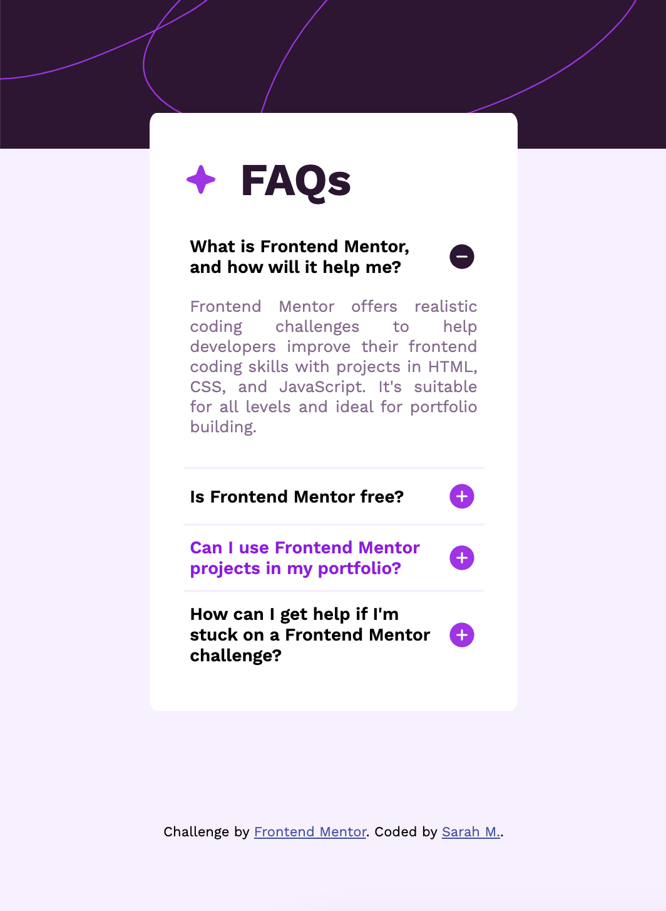
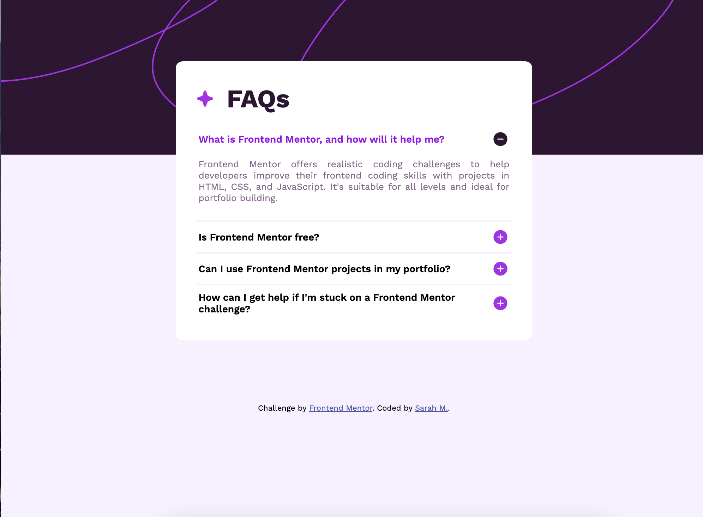

# Frontend Mentor - FAQ accordion solution

This is a solution to the [FAQ accordion challenge on Frontend Mentor](https://www.frontendmentor.io/challenges/faq-accordion-wyfFdeBwBz). Frontend Mentor challenges help you improve your coding skills by building realistic projects. 

## Table of contents

- [Overview](#overview)
  - [The challenge](#the-challenge)
  - [Screenshot](#screenshot)
  - [Links](#links)
- [My process](#my-process)
  - [Built with](#built-with)
  - [What I learned](#what-i-learned)
  - [Continued development](#continued-development)
- [Author](#author)

**Note: Delete this note and update the table of contents based on what sections you keep.**

## Overview

### The challenge

Users should be able to:

- Hide/Show the answer to a question when the question is clicked
- Navigate the questions and hide/show answers using keyboard navigation alone
- View the optimal layout for the interface depending on their device's screen size
- See hover and focus states for all interactive elements on the page

### Screenshot




### Links

- Solution URL: [Add solution URL here](https://your-solution-url.com)
- Live Site URL: [Add live site URL here](https://your-live-site-url.com)

## My process

### Built with

- Semantic HTML5 markup
- CSS custom properties
- Flexbox
- Javascript

### What I learned
Found an interesting way of toggling display of items, by watching for active state in javascript, and having styles for them in css. Made it easy to toggle between displays. Light amount of javascript to get it done this way.
```css
.faq.active .icon-plus{
display: none;
}
.faq.active .icon-minus{
    display: block;
  
}
```
```js
faqs.forEach(faq => {
    faq.addEventListener("click", ()=> {
        faq.classList.toggle('active')
    })
})
```

### Continued development

Will look into ways of smoother transitions between images between clicks, and building similar projects from a mobile first perspective.


## Author

- Website - [Sarah] (https://www.your-site.com)
- Frontend Mentor - [@sar-mko](https://www.frontendmentor.io/profile/sar-mko)
- Linkedin - [Sarah] (https://www.linkedin.com/in/sarah-mko/)

